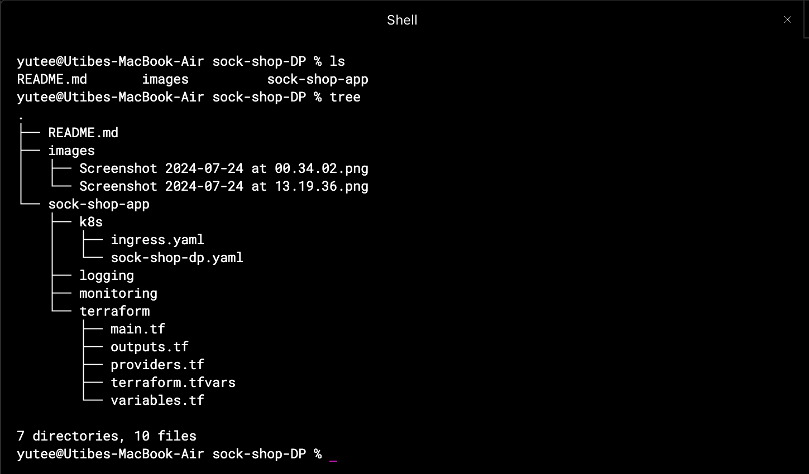
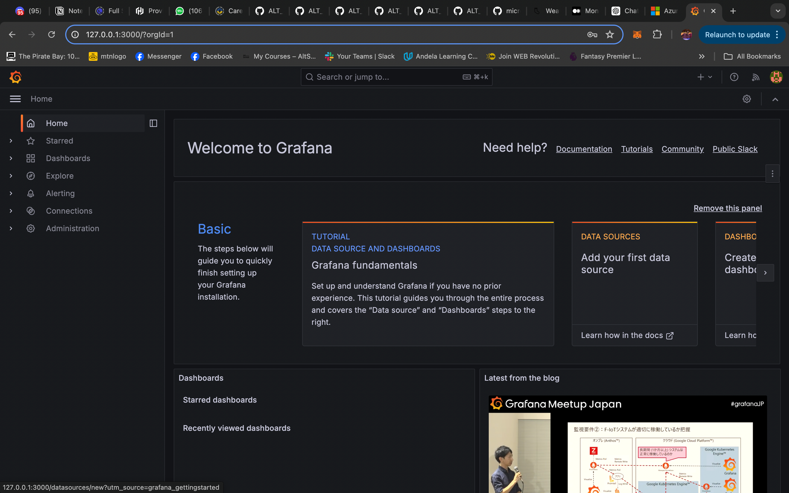

## Deploying a microservices-based architecture application

### Overview:
A microservices architecture divides an application into small, independent services that communicate over a network.
In this project, we'll deploy SockShop, a containerized microservices-based application, using Kubernetes for orchestration.

Core DevOps practices will be employed to automate the deployment of SockShop, this DevOps practices will include:
    - Infrastructure as a Code to automate the provisioning of our resources
    - Container Orchestration
    - Monitoring, Logging & Alerts
    - Continous Development and Continous Integration
    - Security

SockShop includes several microservices, such as the front-end, carts, catalouge, payments and shipping. Each service operates independently but share relevant data accross the deployment. Each microservice is packaged in a docker image and kubernetes is used to deploy and orchestrate the communication between the different services. Below is an architectural diagram illustrating the application's workflow.
    

I setup my project folder to have all key parts of the project.
    

The app and everything needed to run it is in the `sock-shop-app` directory. There are subdirectories in it:
    - K8s - Kubernetes manifest files for the app and ingress yaml file.
    - Logging - Yaml files to handle the needed metrics for logging
    - Monitoring - yaml files to handle the needed metrics for monitoring
    - Terraform - Terraform configuration for provisioning of 

### Prerequisites:
__Technologies__
To complete the setup, you will need access to several utilities and services, they include:
    - Microsoft Azure
    - Terraform 
    - Kubernetes
    - Helm
    - Prometheus & Grafana
    - Github Actions
    - Let's Encrypt
    - Azure KeyVault and Firewall

__Before you start__
The follwing processes assumes you have some basic familiarity with Kubernetes and that you should have these installed:
- Azure account with active subcription
- AzCLI configured on your terminal
- Terraform installed
- Kubectl
- Helm

### Setup Process:
__Terraform__
Clone the repo or setup your folder structure. Navigate to the terraform directory and write/confirm your configuration files to provision a Kubernetes cluster on Microsoft Azure. The terraform [main.tf](sock-shop-app/terraform/main.tf) file includes configurations to create a resource group and an Azure Kubernetes Service within that group.

-------Explain infrastructure configuration--------

_N/B: If you have not previously used docker or any container services in the azure subscription you are plannign to deploy to, you might have to add microsoft container services to the subscription_

Once you are done with your configuration,
Do: `terraform init`
    `terraform plan`
    `terraform apply --auto-approve`

Now, our cluster is up and running, you can visit the portal to investigate.
    

__Connect to the Cluster & configure Kubectl__
You need kubectl to interact with and manage your cluster. Use the follwing steps to link your cluster to your terminal and configure kubectl access.
    
    

__Deploying the microservice-based app on the cluster__
Having provisioned the AKS cluster and setup a connection to it on your terminal, you can now deploy your app. The application is a series of kubernetes files that creates a namespace, deploys pods for the different parts that make up the app and creates services that acts as network layers over the pods.

Do: `kubectl apply -f <name-of-manifest-file.yaml>`
    

Once there are created, you can check that services are up and running.
    

Change context to the sock-shop namespace
Do: `kubectl get all to show (-A or -0 wide)`

To view the app on the browser,
Do `kubectl port-forward service/front-end -n sock-shop 30001:80`
    
    

Now, while the frontend service does enough to expose the app, we need a more flexible and fine-grained control over incoming traffic. An Ingress is needed to give services in the cluster externally-reachable URLs, load balance traffic, terminate SSL/TLS, and offer name-based virtual hosting.

To use ingress, find the [ingress.yaml](sock-shop-app/k8s/ingress.yaml) file with the configurations and install an ingress controller in the cluster, here, the nginx ingress controller will be used.
    

Also, once installed, you will have to update your DNS records with the address pointing to your ingress ip address.
App is now up and running and can be accessible via our domain name, thanks to ingress.
    

__Requesting a certificate__
The app is up but it is not secure... we will request a certificate from using let's encrypt.
    
To reach let's encrypt, we will have to instal cert-manager in our cluster.
    

__Setup monitoring, logging and alerts__
For monitoring, Prometheus is used alongside Grafana for visualization. Added to monitoring, it also offers alerts that ensure admins are notified of a possible probelm before it occurs.

-------Explain what prometheus gathers, and what grafana shows--------

You will have to install prometheus and grafana using helm and then apply the files containing the configurations for targets and metrics to be gotten. There will run as pods on your cluster. It is best practice to run them in a seperate namespace.
    
    
    
    

__Building a CI/CD pipeline__
Continous integration and continous delivery is one of the most important concept in DevOps. It is a set of practices that is used in software development to improve the process of delivering code changes. It helps deliver software more quickly and with higher quality by automating testing and deployment.
Github Actions will be used to build a ci/cd pipeline for the continous deployment and automation of the Sockshop app. 

The workflow file can be found [here.](.github/workflows/deploy_pipeline.yml)
The pipeline is triggered with every push to the repo and it starts jobs that:
    - Installs Helm, Azcli, Prometheus and Grafana
    - Configures Azure account, Kubectl
    - Updates the app with updated configurations to any part of kubernetes application by applying all configuration files

Testing the pipeline:
Initially, the frontend service which serves as an entry point to our app was configured with type nodeport, but as we now use ingress to expose the service, it is required that we reconfigure the service to type cluster ip.
    

We will make this change and push it to the repo from our local system.
    
    

After succcessful run of the pipeline
    

We can go back to check our services and confirm the type that the frontend service is of:
    

In a similar manner, the pipeline will be responsible for any changes to our application and ensure it is delivered swifty to our cluster.

